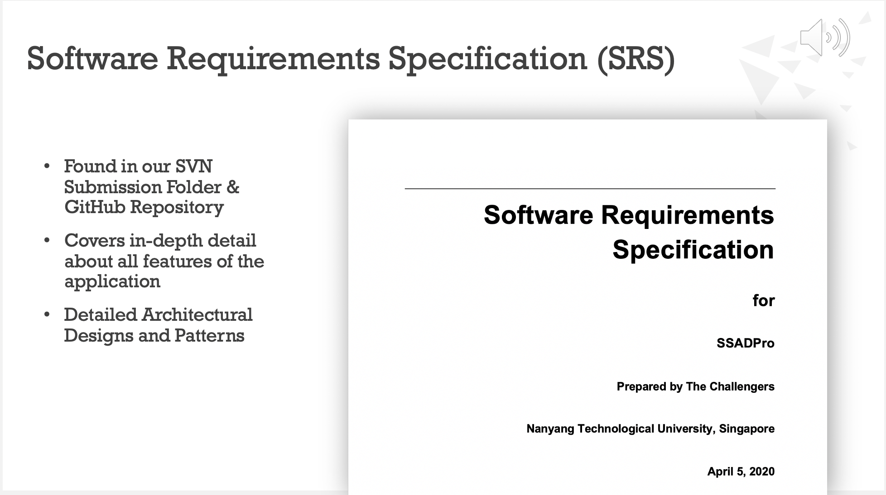

# SSADPro

SSADPro is an application built for CZ3003 Software Systems Analysis & Design.

Our product aims to gamify and socialize teaching and learning of software engineering courses.

It is a follow up member of a family of products which seek to make the learning process interactive and fun and increase productivity with elements of ‘Challenge’ and ‘Points’.

> CZ3003 Software Systems Analysis & Design \
> School of Computer Science and Engineering \
> Nanyang Technological University

## Installation

Make sure you have the following dependencies available:

* Linux, Mac OS X, or Windows.

* git (used for source version control).

* An IDE. Android Studio with the Flutter plugin is our flagship IDE. You can use whatever IDE you feel most comfortable with.

* An ssh client (used to authenticate with GitHub).

* Python (used by some of our tools).

* The Android platform tools.

You can install this using one of the following commands:

* Mac: `brew cask install android-platform-tools`
* Linux: `sudo apt-get install android-tools-adb`

If you're also working on the Flutter engine, you can use the copy of the Android platform tools in `.../engine/src/third_party/android_tools/sdk/platform-tools`.

Run the following steps to set up your environment:

1. Ensure that `adb` (from the Android platform tools) is in your path (e.g., that `which adb` prints sensible output).

2. Fork `https://github.com/flutter/flutter` into your own GitHub account. If you already have a fork, and are now installing a development environment on a new machine, make sure you've updated your fork so that you don't use stale configuration options from long ago.

3. If you haven't configured your machine with an SSH key that's known to github then follow the directions here: https://help.github.com/articles/generating-ssh-keys/.

4. `git clone git@github.com:<your_name_here>/flutter.git`

5. `cd flutter`

6. `git remote add upstream git@github.com:flutter/flutter.git` (So that you fetch from the master repository, not your clone, when running `git fetch` et al.)

7. Add this repository's `bin` directory to your path. That will let you use the `flutter` command in this directory more easily.

8. Run `flutter update-packages` This will fetch all the Dart packages that Flutter depends on. If version solving failed, try `git fetch upstream` to update Flutter versions before `flutter update-packages`. (You can replicate most of what this script does by running `pub get` in each directory that contains a `pubspec.yaml` file, which is rather tedious, hence the script.)

9. If you plan on using IntelliJ as your IDE, then also run `flutter ide-config --overwrite` to create all of the IntelliJ configuration files so you can open the main flutter directory as a project and run examples from within the IDE.

To run an example, switch to that SSADPro's directory, and use `flutter run`. Make sure you have an emulator running, or a device connected over USB and debugging enabled on that device.

* `cd SSADPro/ssad_pro`
* `flutter run`

> Flutter Environment Setup Guide retrieved from [here](https://github.com/flutter/flutter/wiki/Setting-up-the-Framework-development-environment).

## Authors

* Kiran Mac Milin
* Gupta Jay
* Vaish Arjun
* Kanodia Ritwik
* Bhatia Ritik
* Hasan Mohammad Yusuf
* Koh Zhuang Chean
* Mundhra Divyesh
* Asok Kumar Gaurav
* Bhadra Soham
* Truong Quang Duc
* Yap Jay Shen

## Icon Acknowledgements

 * [Freepik](https://www.flaticon.com/authors/freepik) from [www.flaticon.com](https://www.flaticon.com/)
 * [Smashicons](https://www.flaticon.com/authors/smashicons) from [www.flaticon.com](https://www.flaticon.com/)
 * [Payungkead](https://www.flaticon.com/authors/payungkead) from [www.flaticon.com](https://www.flaticon.com/)
 * [Vectors Market](https://www.flaticon.com/authors/vectors-market) from [www.flaticon.com](https://www.flaticon.com/)
 

